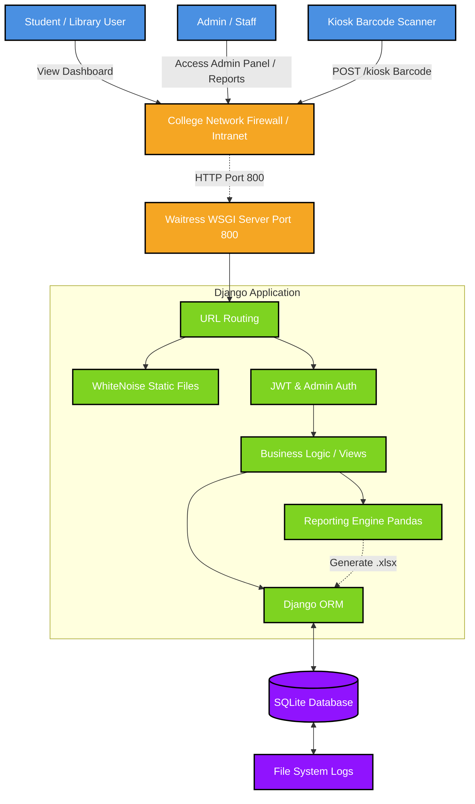

# GECDahod Library System - Production Server

This is the **Production** branch. This branch is configured to run on your college's local network server for real-world use.

## System Architecture

Here is the high-level architecture of the GECDahod Library System. It leverages Waitress as a production WSGI server and WhiteNoise for static files, making it a robust and self-contained solution for local network deployment.



## Deployment Steps (College Server)

1. **Clone the Production branch:**
   ```bash
   git clone -b production https://github.com/PAVAN2005-LAB/GED_Dahod_library.git
   ```

2. **Setup Environment:**
   - Install dependencies: `pip install -r requirements.txt`
   - Create a `.env` file from `.env.example`.
   - **Crucial:** Set `DJANGO_DEBUG=False` and `DJANGO_ALLOWED_HOSTS=*`.

3. **Prepare Static Files & Database:**
   ```bash
   python manage.py makemigrations
   python manage.py migrate
   python manage.py collectstatic --noinput
   ```

4. **Start the Server (Running on Port 800):**
   ```bash
   python run_server.py
   ```

## Accessing the System
Once the server is running, anyone on the college network can access it by visiting the server's IP address and port 800:
`http://[YOUR_SERVER_IP]:800`
 check your ip address by typing `ipconfig` in the command prompt.

---

## 🐳 Docker Deployment (No Python Required)

If you don't have Python installed, or prefer deploying via containers, you can use Docker.

1. **Build the Docker Image:**
   Open a terminal in the project directory where the `Dockerfile` is located and run:
   ```bash
   docker build -t library-system .
   ```

2. **Run the Container:**
   Once built, start the server and map port 800:
   ```bash
   docker run -p 800:800 --name library-container library-system
   ```

The application is now containerized and accessible at `http://localhost:800` (or your server's IP).

---

## Bulk Import Data (Students & Books)

You can easily bulk import students and books from standard `.csv` files using our custom management command `import_data`. This is built for fast ingestion while automatically checking for and skipping duplicate entries.

### Import Students
*Expected CSV Headers: `enrollment_id`, `name`, `email`, `mobile_no`, `department`*
```bash
python manage.py import_data students /absolute/path/to/your/students.csv
```

### Import Books
*Expected CSV Headers: `access_code`, `title`, `author`, `shelf_location`*  
*(Note: `access_code` maps to Book ID in the database)*
```bash
python manage.py import_data books /absolute/path/to/your/books.csv
```

---

## API Endpoints Documentation

We provide a comprehensive REST API and dedicated Web endpoints for scanning, reports, and JWT authentication. 

**[Click here to read the full API Documentation](API_DOCS.md)**

---

## Key Production Features
- **Waitress Server**: Handles multiple users concurrently on Windows.
- **WhiteNoise Middleware**: Fast and efficient serving of CSS/JS/Images.
- **Port 800**: Standard access on port 800, freeing up default ports and bypassing standard admin restrictions for port 80.
- **Pandas Reporting**: Heavy data processing handled gracefully with Pandas generating `.xlsx` reports on the fly.

---
**Note:** For development and code changes, please use the `local` branch.
